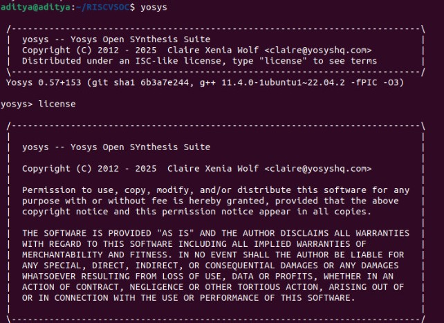
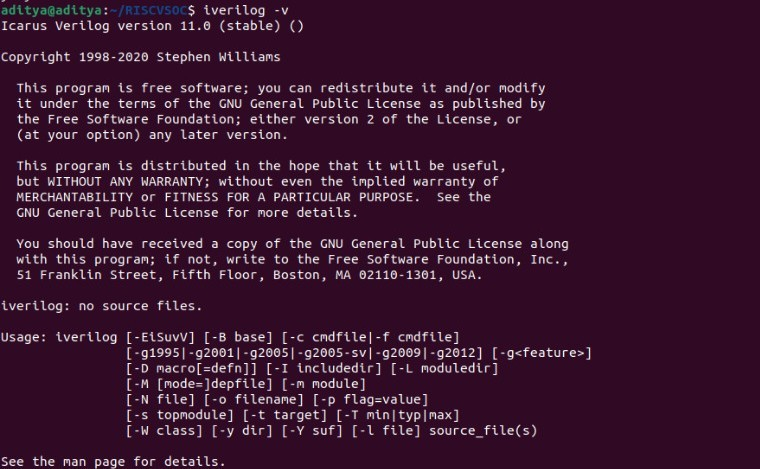
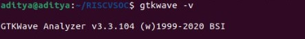
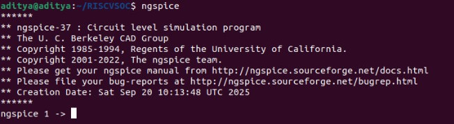
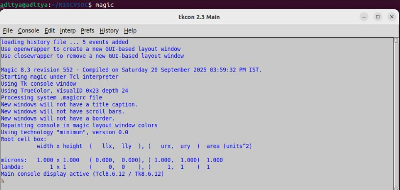
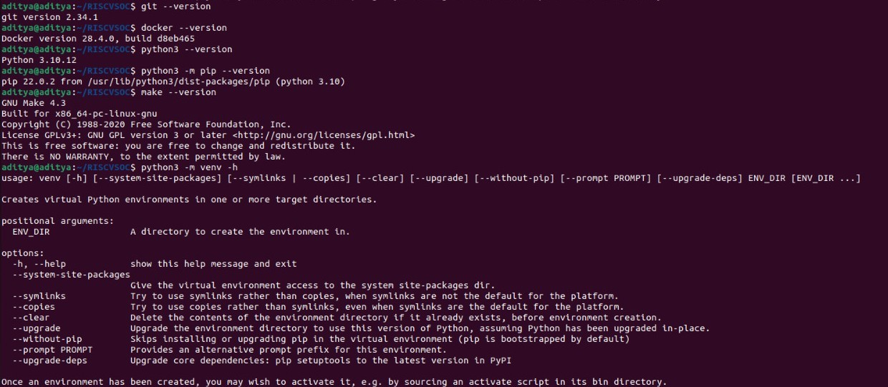
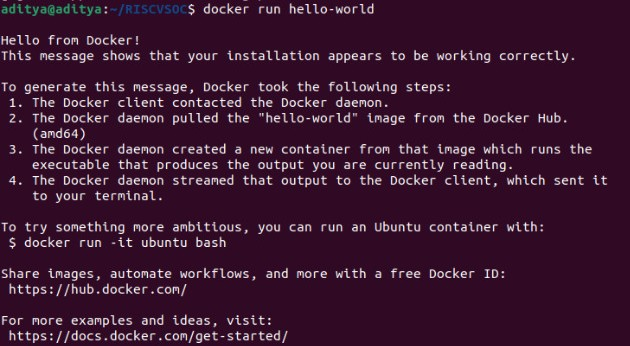

## Table of Contents

| Week  | Tools / Sections |
|-------|-----------------|
| 0     | - [Yosys](#yosys)<br>- [Icarus Verilog](#icarus-verilog)<br>- [GTKWave](#gtkwave)<br>- [ngspice](#ngspice)<br>- [Magic](#magic)<br>- [Docker](#docker)<br>- [OpenLane](#openlane) |


## Week-0

### Yosys
Yosys is an open-source framework for Verilog RTL synthesis. It's used to convert the human-readable HDL (Verilog) into a gate-level netlist.

```bash
sudo apt-get update
git clone https://github.com/YosysHQ/yosys.git
cd yosys
sudo apt install make
sudo apt-get update
sudo apt-get install -y build-essential clang bison flex libreadline-dev gawk tcl-dev libffi-dev git graphviz xdot pkg-config python3 libboost-system-dev libboost-python-dev libboost-filesystem-dev zlib1g-dev
make config-gcc
git submodule update --init --recursive
make
sudo make install 
```



### Icarus Verilog
Icarus Verilog is a compiler and simulator for the Verilog language.

```bash
sudo apt-get update
sudo apt-get install iverilog
```



### GTKWave
GTKWave is a digital waveform viewer used to analyze the simulation results generated by tools like Icarus Verilog.

```bash
sudo apt-get update 
sudo apt install libcanberra-gtk-module libcanberra-gtk3-module
sudo apt install gtkwave
```



### ngspice
ngspice is an open-source mixed-level/mixed-signal circuit simulator. It's essential for analyzing the analog behavior of circuits.

Download from [https://sourceforge.net/projects/ngspice/files/](https://sourceforge.net/projects/ngspice/files/)

```bash
tar -zxvf ngspice-37.tar.gz
cd ngspice-37
mkdir release
cd release
../configure --with-x --with-readline=yes --disable-debug
make
sudo make install
```


### Magic
Magic is a venerable VLSI layout editor. It's used for creating and modifying the physical layout of integrated circuits, which is the final step before fabrication.

```bash
sudo apt-get install m4 tcsh csh libx11-dev tcl-dev tk-dev libcairo2-dev mesa-common-dev libglu1-mesa-dev libncurses-dev
git clone https://github.com/RTimothyEdwards/magic
cd magic
./configure
make
sudo make install
```



### Docker
Docker is a platform that uses OS-level virtualization to deliver software in packages called containers. It is a prerequisite for running the OpenLane flow, as it ensures a consistent and reproducible environment for all the tools.

```bash
sudo apt-get update
sudo apt-get upgrade
sudo apt install -y build-essential python3 python3-venv python3-pip make git
sudo apt install apt-transport-https ca-certificates curl software-properties-common
curl -fsSL https://download.docker.com/linux/ubuntu/gpg | sudo gpg --dearmor -o /usr/share/keyrings/docker-archive-keyring.gpg
echo "deb [arch=amd64 signed-by=/usr/share/keyrings/docker-archive-keyring.gpg] https://download.docker.com/linux/ubuntu $(lsb_release -cs) stable" | sudo tee /etc/apt/sources.list.d/docker.list > /dev/null
sudo apt update
sudo apt install docker-ce docker-ce-cli containerd.io
sudo docker run hello-world
sudo groupadd docker
sudo usermod -aG docker $USER
sudo reboot

# After reboot
docker run hello-world
```





### OpenLane
OpenLane is an automated RTL-to-GDSII flow that integrates a suite of open-source tools to take a design from a hardware description to a final physical layout file. Note: Docker must be installed and configured before proceeding.

```bash
cd $HOME
git clone https://github.com/The-OpenROAD-Project/OpenLane
cd OpenLane
make
make test
```
