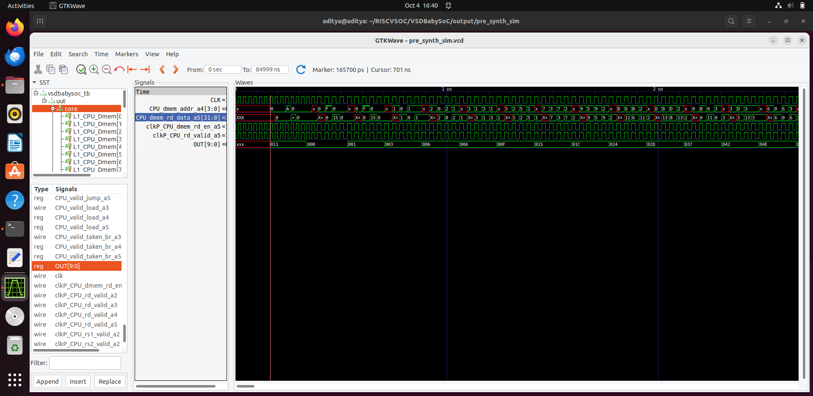
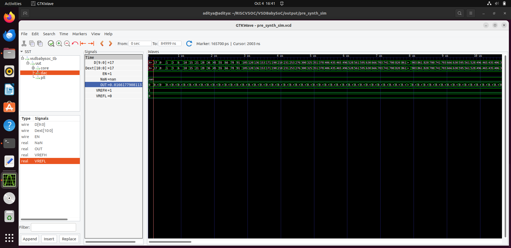
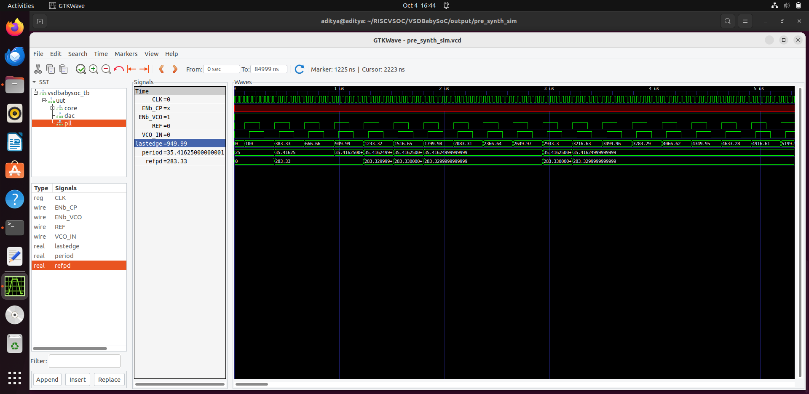
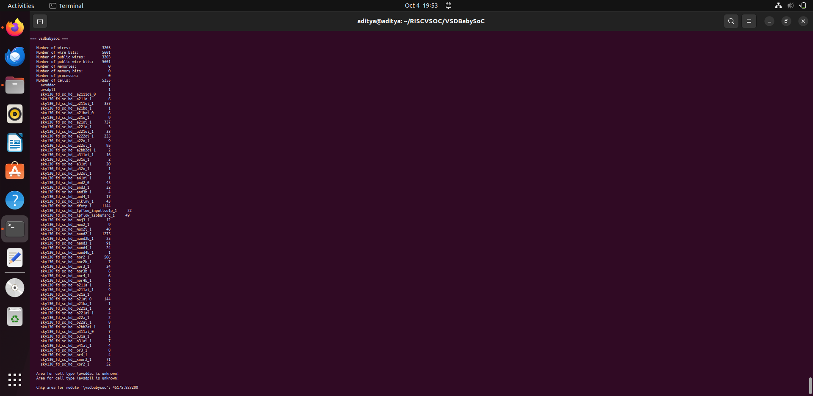
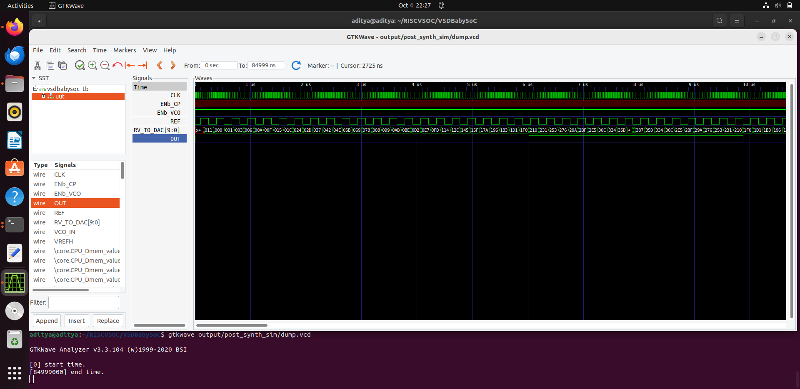
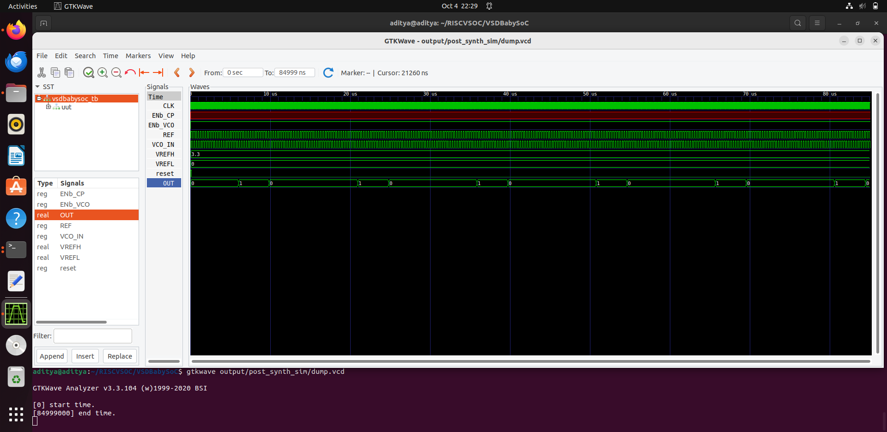

| Section | Topic |
| :------ | :----------------------------------------------------------------- |
| 1 | [What is a System-on-Chip (SoC)?](#1-what-is-a-system-on-chip-soc) |
| 2 | [The Core Components of an SoC](#2-the-core-components-of-an-soc) |
| 3 | [Why Use a "BabySoC" for Learning?](#3-why-use-a-babysoc-for-learning) |
| 4 | [The Critical Role of Functional Modelling](#4-the-critical-role-of-functional-modelling) |
| 5 | [📘 Week 2 Lab: BabySoC Functional Modelling & Synthesis](#-week-2-lab-babysoc-functional-modelling--synthesis) |
| 5.1 | [🛠️ Project Setup](#1-️-project-setup) |
| 5.2 | [🧪 RTL Simulation (Pre-Synthesis)](#2-rtl-simulation-pre-synthesis) |
| 5.3 | [🧠 Synthesis with Yosys](#3-synthesis-with-yosys) |
| 5.4 | [🔬 Gate-Level Simulation (Post-Synthesis)](#4-gate-level-simulation-post-synthesis) |
| 5.5 | [🔑 Key Takeaways](#-key-takeaways) |
---

## 1. What is a System-on-Chip (SoC)?

A **System-on-Chip (SoC)** is a highly integrated circuit where multiple functional blocks of a computing system are embedded on a single silicon chip. Instead of having separate ICs for the processor, memory, and I/O devices, an SoC consolidates all these parts into one. This approach reduces board size, power consumption, and overall cost, while increasing efficiency and speed.

Because of these benefits, SoCs are widely used in:
* **Mobile devices** (smartphones, tablets, wearables)
* **IoT and embedded systems** (smart appliances, automotive ECUs)
* **Networking and communication devices**
* **High-performance processors** in laptops and servers

The core purpose of an SoC is to bring **computation, storage, communication, and control** together on a single platform.

---

## 2. The Core Components of an SoC

A typical SoC is built from several key building blocks that work in harmony.

### CPU (Central Processing Unit): The Brain
The CPU is the primary processor that acts as the brain of the SoC, and its main job is to execute software instructions. A CPU can have one or more "cores," with popular architectures being RISC-V or ARM Cortex. Each core contains the fundamental logic for calculations (ALUs), decision-making (control logic), and efficient instruction processing (pipelines).

### Memory: The Workspace
The SoC needs memory to hold the data and instructions the CPU is actively working on. This is organized in a hierarchy to balance speed with capacity:
* **On-Chip Memory**: For the fastest possible data access, small and very fast memory blocks are placed directly on the SoC. This includes **cache (L1/L2/L3)** and **SRAM** for temporary storage.
* **External Memory Interfaces**: Since on-chip memory is limited, the SoC has controllers to connect to much larger memory sources outside the chip, like **DRAM** or **Flash** non-volatile memory.

### Peripherals: Interacting with the World
Peripherals are the components that give the SoC the ability to communicate and interact with the outside world. Examples include:
* **UART** for serial communication
* **SPI / I²C** for interfacing with sensors
* **GPIOs** for controlling simple signals
* **ADC/DAC** for interacting with real-world analog signals
* SoCs can also include specialized peripherals like DMA controllers or cryptographic accelerators.

### Interconnect: The Internal Highway System
The interconnect, or bus fabric, is the network of communication pathways that connects the CPU, memory, and peripherals. This internal highway system ensures that data can flow efficiently and without conflict between all the different parts of the chip. Industry standards like **AMBA (AXI, AHB, APB)** are often used to manage this traffic.

---

## 3. Why Use a "BabySoC" for Learning?

A **BabySoC** is an SoC that has been intentionally simplified for educational purposes, making it perfect for beginners. While a real-world SoC is enormously complex, a BabySoC contains all the essential elements needed for learning but on a much smaller scale. For example, a BabySoC might only contain one RISC-V CPU core, an SRAM block, and basic UART and GPIO peripherals.

This approach is beneficial because it allows learners to focus on core concepts like data flow and CPU-peripheral interaction without being overwhelmed by industrial-scale details. It provides a clear, step-by-step learning path from simulation to RTL design and finally to physical design, helping students gain confidence before moving on to more advanced projects.

---

## 4. The Critical Role of Functional Modelling

Before engineers start designing the actual hardware (RTL), they first create a **functional model** of the SoC. This is a high-level software representation that describes exactly *what* the system is supposed to do, without worrying about the low-level implementation details.

This "blueprint" phase is critical for a few reasons:
* **Early Validation and Debugging**: It allows the architecture to be tested and validated very early in the process. Finding and fixing a logical flaw in a high-level model is far easier and cheaper than finding it after the hardware has been designed.
* **Design Exploration**: Designers can experiment with different configurations—such as trying different CPU types or memory sizes—to analyze performance trade-offs before committing to a specific design.
* **Avoid Expensive Mistakes**: A fundamental design flaw that is only discovered after the chip is physically manufactured can lead to an **expensive "re-spin"** (a complete do-over), costing millions of dollars and months of delays. Functional modelling serves as a crucial safety check to prevent this.

# 📘 Week 2 Lab: BabySoC Functional Modelling & Synthesis

## Objective
This lab will guide you through the functional simulation and synthesis of a simple System-on-Chip (SoC), the "BabySoC". You will verify its behavior before synthesis (RTL) and after synthesis (gate-level) using Icarus Verilog, GTKWave, and Yosys.

---

## 1. 🛠️ Project Setup

First, let's set up the project environment.

#### A. Clone the Repository
Open a terminal and navigate to your workspace.

```bash
# Navigate to your main VLSI directory
cd ~/VLSI

# Clone the project repository
git clone https://github.com/manili/VSDBabySoC.git

# Enter the project directory
cd VSDBabySoC/
```

#### B. Project Directory Structure
For your reference, the key files are organized as follows:
```text
VSDBabySoC/
├── src/
│   ├── include/        # Header files (*.vh)
│   ├── module/         # Verilog source files (*.v)
│   │   ├── vsdbabysoc.v  # Top-level SoC module
│   │   ├── rvmyth.v      # CPU Core
│   │   ├── avsdpll.v     # PLL model
│   │   ├── avsddac.v     # DAC model
│   │   └── testbench.v   # Testbench for simulation
│   └── lib/            # Liberty files for synthesis (*.lib)
└── reports/            # Output directory for synthesis reports & netlists
```

#### C. Convert TL-Verilog to Verilog
The CPU core (`rvmyth`) is written in TL-Verilog. We need to convert it to standard Verilog using the SandPiper tool.

```bash
# Install required Python tools
sudo apt update
sudo apt install python3-venv python3-pip

# Create and activate a Python virtual environment
python3 -m venv sp_env
source sp_env/bin/activate

# Install the SandPiper-SaaS tool
pip install pyyaml click sandpiper-saas

# Run the conversion
sandpiper-saas -i ./src/module/*.tlv -o rvmyth.v --outdir ./src/module/

#### D. Add Stub Files for Synthesis
For synthesis, we use simplified "stub" models for the analog PLL and DAC modules. Make sure you have downloaded `avsddac_stub.v` and `avsdpll_stub.v` and placed them in the `src/module/` directory.
```
---

## 2. 🧪 RTL Simulation (Pre-Synthesis)

We will now simulate the design at the Register-Transfer Level (RTL) to verify its logic before synthesizing it into gates.

#### A. Run the Simulation
```bash
# Create a directory for the simulation output
mkdir -p output/pre_synth_sim

# Compile the Verilog files
iverilog -o output/pre_synth_sim/pre_synth_sim.out \
  -DPRE_SYNTH_SIM \
  -I src/include -I src/module \
  src/module/testbench.v

# Execute the compiled simulation
./output/pre_synth_sim/pre_synth_sim.out

#### B. Analyze the Waveforms
Use GTKWave to view the results. The simulation will produce a `pre_synth_sim.vcd` file.
```
```bash
gtkwave pre_synth_sim.vcd
```
#### C. Expected Results

1.  **CPU Core and Memory Interface:**
    
    - *Hierarchy:* `vsdbabysoc_tb` -> `u_dut` -> `core` -> `L1_CPU_dmem`
    - *Analysis:* At timestamp **1657 ns**, signals indicate the CPU is performing a memory read (`CPU_dmem_rd_en` is high). The core successfully places the value **`0x313`** onto the top-level `OUT[9:0]` bus, verifying a successful read and output operation.

2.  **Digital-to-Analog Converter (DAC) Verification:**

    - *Hierarchy:* `vsdbabysoc_tb` -> `u_dut` -> `dac`
    - *Analysis:* At timestamp **165.7 ns** (`165700 ps`), the DAC's input `D[9:0]` correctly shows the digital value **`17`**. The DAC's analog-style output (`OUT`) changes in response, confirming that the data path from the SoC bus to the DAC is functional.

3.  **Phase-Locked Loop (PLL) Verification:**
    - *Hierarchy:* `vsdbabysoc_tb` -> `u_dut` -> `pll`
    - *Analysis:* At timestamp **1225 ns**, the waveforms confirm the PLL is stable and active. The lower-frequency `REF` (reference clock) signal is successfully used to generate the higher-frequency system `CLK`, verifying that the SoC's clock generation unit is working as expected.

    

---

## 3. 🧠 Synthesis with Yosys

Next, we convert our human-readable RTL code into a gate-level netlist using the Yosys synthesis tool. This netlist describes the design using only standard logic gates from the SKY130 technology library.

#### A. Yosys Synthesis Script
Create a file named `synthesis.ys` and paste the following commands into it.

```tcl
# --- Part 1: Read Libraries and Design ---
read_liberty -lib src/lib/sky130_fd_sc_hd__tt_025C_1v80.lib
read_liberty -lib src/lib/avsddac.lib
read_liberty -lib src/lib/avsdpll.lib

read_verilog src/module/vsdbabysoc.v
read_verilog -I src/include src/module/rvmyth.v
read_verilog -I src/include src/module/clk_gate.v
read_verilog src/module/avsddac_stub.v
read_verilog src/module/avsdpll_stub.v

# --- Part 2: Synthesize the Design ---
# This command synthesizes the logic but keeps modules separate
synth -top vsdbabysoc

# Map flip-flops and perform optimizations
dfflibmap -liberty src/lib/sky130_fd_sc_hd__tt_025C_1v80.lib
opt
abc -liberty src/lib/sky130_fd_sc_hd__tt_025C_1v80.lib

# --- Part 3: Flatten and Clean Up ---
# Merge all modules into a single top-level design
flatten
setundef -zero
clean -purge
rename -enumerate

# --- Part 4: Write Final Netlist and Statistics ---
write_verilog -noattr reports/vsdbabysoc_netlist.v
stat -liberty src/lib/sky130_fd_sc_hd__tt_025C_1v80.lib
```

#### B. Run Yosys
Execute the script by running Yosys from your terminal:

```bash
yosys -s synthesis.ys
```
#### C. Synthesis Outputs
Yosys will generate the final gate-level netlist at `reports/vsdbabysoc_netlist.v` and print area and cell statistics in the terminal.


---

## 4. 🔬 Gate-Level Simulation (Post-Synthesis)

Finally, we perform a Gate-Level Simulation (GLS) to confirm that the synthesized netlist behaves identically to our original RTL design.

#### A. Run the GLS
This command is more complex because it must include the Verilog models for the SKY130 standard cells.

```bash
# Create a directory for the GLS output
mkdir -p simulation

# Compile the netlist, standard cell models, stubs, and testbench
iverilog -g2012 -DFUNCTIONAL \
  -o simulation/post_synth_sim.out \
  src/gls_model/primitives.v \
  src/gls_model/sky130_fd_sc_hd.v \
  reports/vsdbabysoc_netlist.v \
  src/module/avsdpll_stub.v \
  src/module/avsddac_stub.v \
  src/module/testbench.v

# Execute the compiled GLS
./simulation/post_synth_sim.out
```
#### B. Analyze the GLS Waveforms
Open the resulting waveform file with GTKWave. Your testbench should be configured to create `dump.vcd`.

```bash
gtkwave dump.vcd
```
The waveforms should functionally match the results from the pre-synthesis simulation, confirming the synthesis was successful.



---

## 🔑 Key Takeaways
- **RTL Simulation** is crucial for verifying logical correctness before synthesis.
- **Synthesis** converts abstract RTL into a physical implementation using standard cells.
- **Gate-Level Simulation** is the final check to ensure the synthesis tool did not alter the design's functionality.
- This complete flow bridges the gap from initial design to a verified, hardware-ready netlist.
