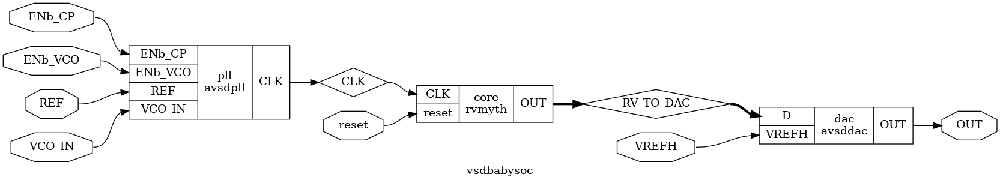
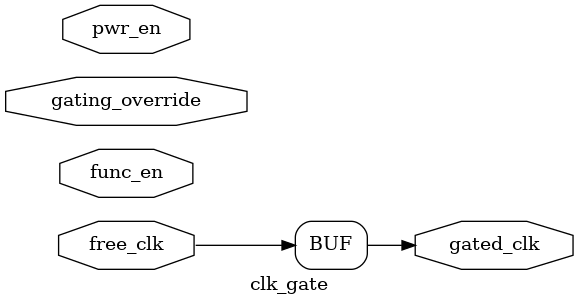
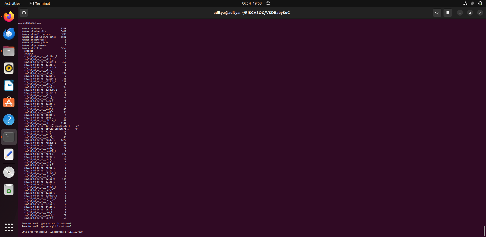
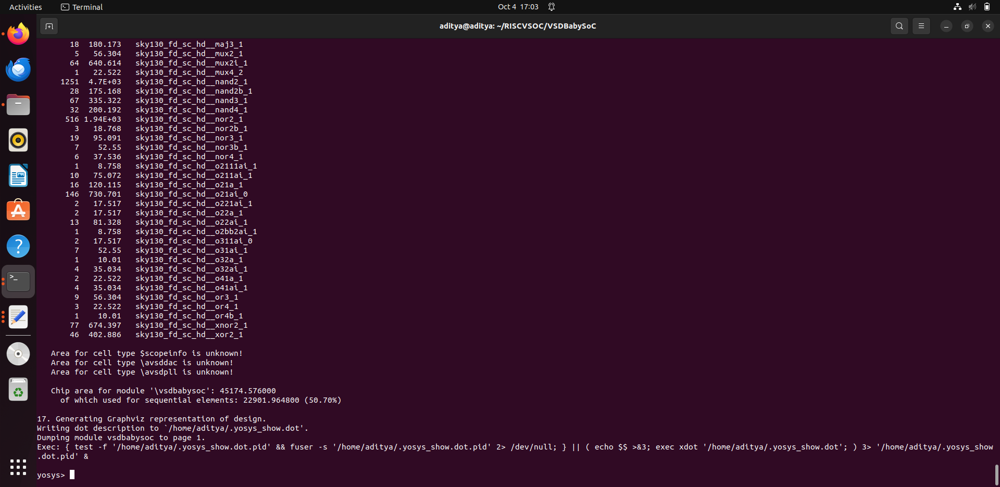
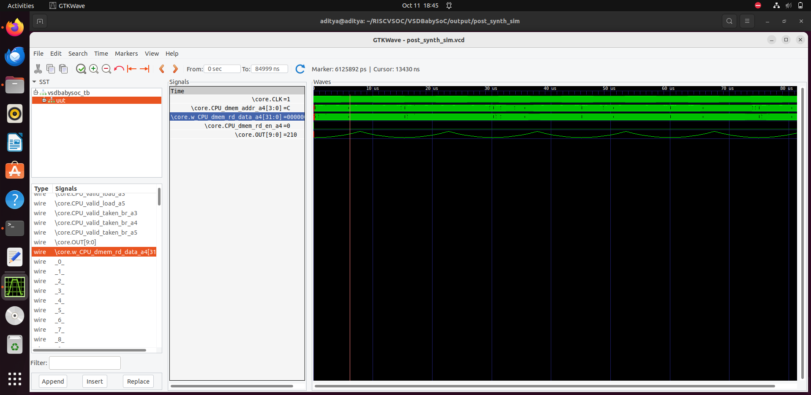
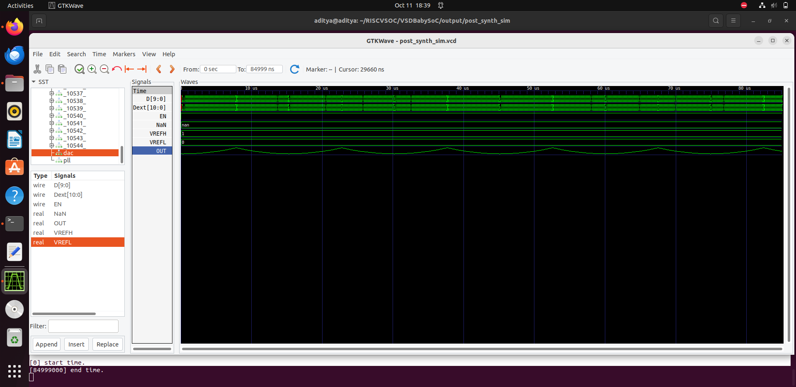
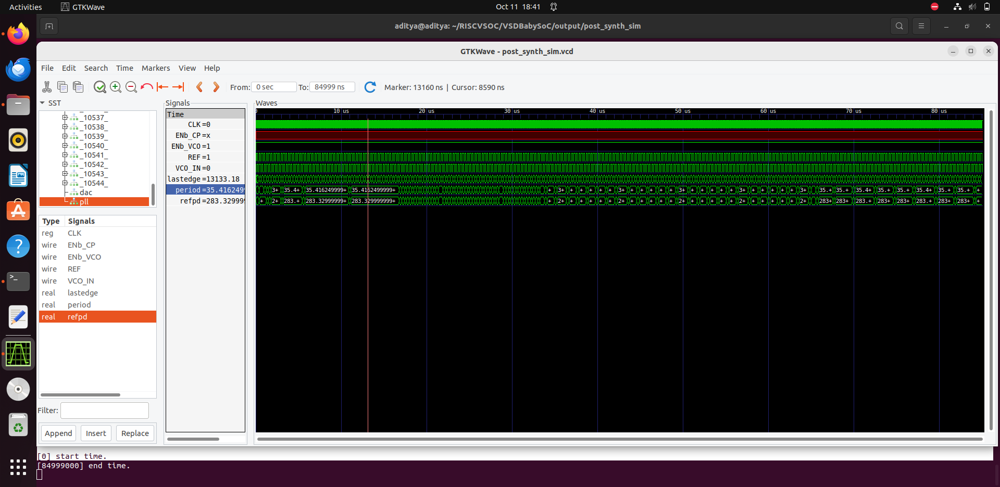

# 📘 Week 3 Task - Post-Synthesis GLS & STA Fundamentals

## 📑 Table of Contents

| #  | Section                                     |
|----|---------------------------------------------|
| 1  | [Objective](#objective)                                |
| 2  | [Step 1 – Synthesis of BabySoC](#step-1--synthesis-of-babysoc)               |
| 3  | [Step 2 – Post-Synthesis GLS](#step-2--post-synthesis-gls)                 |
| 4  | [Functional vs Gate-Level Simulation](#functional-vs-gate-level-simulation)         |

---

## Objective
Perform **Gate-Level Simulation (GLS)** after synthesis to verify functionality, and explore **Static Timing Analysis (STA)** using **OpenSTA**.

---

## Step 1 – Synthesis of BabySoC

### Read Libraries and Design
```bash
read_liberty -lib src/lib/sky130_fd_sc_hd__tt_025C_1v80.lib
read_liberty -lib src/lib/avsddac.lib
read_liberty -lib src/lib/avsdpll.lib
read_verilog src/module/vsdbabysoc.v
read_verilog -I src/include src/module/rvmyth.v
read_verilog -I src/include src/module/clk_gate.v
read_verilog src/module/avsddac_stub.v
read_verilog src/module/avsdpll_stub.v
```

### View RTL Design Before Synthesis
```bash
show -format png -prefix output_snapshots/vsdbabysoc_rtl vsdbabysoc
```

### Synthesize Design
```bash
synth -top vsdbabysoc
dfflibmap -liberty src/lib/sky130_fd_sc_hd__tt_025C_1v80.lib
opt
abc -liberty src/lib/sky130_fd_sc_hd__tt_025C_1v80.lib
```

### Generate Gate-Level PNGs
```bash
show -format png -prefix output_snapshots/netlist_clk_gate clk_gate
show -format png -prefix output_snapshots/netlist_avsdpll_stub avsdpll_stub
show -format png -prefix output_snapshots/netlist_avsddac_stub avsddac_stub
```

### Flatten and Cleanup
```bash
flatten
setundef -zero
clean -purge
rename -enumerate
```

### Write Final Netlist and Stats
```bash
write_verilog -noattr output_snapshots/vsdbabysoc_netlist.v
stat -liberty src/lib/sky130_fd_sc_hd__tt_025C_1v80.lib
```

---






---

## Step 2 – Post-Synthesis GLS

### Compile Testbench
```bash
iverilog -o output_snapshots/post_synth_sim.out -DPOST_SYNTH_SIM -DFUNCTIONAL -DUNIT_DELAY=#1 \
-I src/include -I src/module src/module/testbench.v
```

### Run Simulation
```bash
cd output_snapshots
vvp post_synth_sim.out
```

### View Waveforms
```bash
gtkwave post_synth_sim.vcd
```

---





---

## Functional vs Gate-Level Simulation

- **Functional Simulation**: Checks **RTL logic** only, fast, abstract, acts as the **reference model**.  
- **Synthesis**: Converts RTL into **gate-level netlist** with actual gates.  
- **Gate-Level Simulation (GLS)**: Checks the synthesized netlist; can include **timing**; verifies RTL functionality is preserved.  

**Why Outputs Should Match:**  
- Confirms **synthesis is correct**.  
- Mismatches indicate:
  - Synthesis or constraint errors.
  - RTL bugs visible only post-synthesis.

---