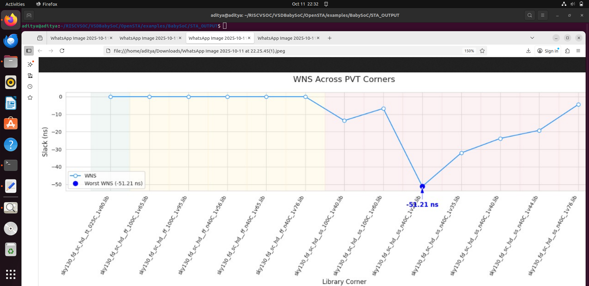

# 📘 Week 3 Task 3 - Post-Synthesis GLS & STA Fundamentals

## Table of Contents
| #  | Section                                      |
|----|----------------------------------------------|
| 1  | [Objective](#objective)|
| 2  | [OpenSTA Installation](#opensta-installation) |
| 3  | [Timing Analysis Using Inline Commands](#timing-analysis-using-inline-commands) |
| 4  | [SPEF-Based Timing Analysis](#spef-based-timing-analysis) |
| 5  | [Timing Analysis Using TCL Script](#timing-analysis-using-tcl-script) |
| 6 | [VSDBabySoC Timing Analysis](#vsdbabysoc-timing-analysis) |
| 7 | [PVT Corner Analysis](#pvt-corner-analysis) |
| 8 | [Python Scripts for Plotting](#python-scripts-for-plotting) |

## Objective

Static Timing Analysis (STA) checks a design for timing violations without depending on input data values. Timing simulation can also verify timing, but STA is faster and data-independent.

## OpenSTA Installation

### Clone and Build
```bash
git clone https://github.com/parallaxsw/OpenSTA.git
cd OpenSTA
docker build --file Dockerfile.ubuntu22.04 --tag opensta .
```

### Run OpenSTA
```bash
docker run -i -v $HOME:/data opensta
```


You should see the `%` prompt, ready for STA commands.

## Timing Analysis Using Inline Commands

### Basic STA Flow (Example: nangate45_slow.lib.gz)
```bash
read_liberty /OpenSTA/examples/nangate45_slow.lib.gz
read_verilog /OpenSTA/examples/example1.v
link_design top
create_clock -name clk -period 10 {clk1 clk2 clk3}
set_input_delay -clock clk 0 {in1 in2}
report_checks
```

Max (setup) paths are shown by default. Use `-path_delay min` for hold or `-path_delay min_max` for both.


### Yosys Synthesis (example1.v)
```bash
cd VSDbabysoc/opensta/examples
yosys
read_liberty -lib nangate45_slow.lib
read_verilog example1.v
synth -top top
show
```


### Fast & Typical Libraries
Use the same commands with `nangate45_fast.lib.gz` and `nangate45_typ.lib.gz`.  
  
  
  
  

## SPEF-Based Timing Analysis
Include parasitics for more realistic delays.

```bash
docker run -i -v $HOME:/data opensta
read_liberty /OpenSTA/examples/nangate45_slow.lib.gz
read_verilog /OpenSTA/examples/example1.v
link_design top
read_spef /OpenSTA/examples/example1.dspef
create_clock -name clk -period 10 {clk1 clk2 clk3}
set_input_delay -clock clk 0 {in1 in2}
report_checks
```

Additional options:
```bash
report_checks -digits 4 -fields capacitance
report_checks -digits 4 -fields [list capacitance slew input_pins fanout]
report_power
report_pulse_width_checks
report_units
```


## Timing Analysis Using TCL Script
Automate min/max analysis:
```bash
read_liberty -max /data/Riscv_soc/VSDBabySoC/OpenSTA/examples/nangate45_slow.lib.gz
read_liberty -min /data/Riscv_soc/VSDBabySoC/OpenSTA/examples/nangate45_fast.lib.gz
read_verilog /data/Riscv_soc/VSDBabySoC/OpenSTA/examples/example1.v
link_design top
create_clock -name clk -period 10 {clk1 clk2 clk3}
set_input_delay -clock clk 0 {in1 in2}
report_checks -path_delay min_max
```

Run non-interactively:
```bash
docker run -it -v $HOME:/data opensta /data/Riscv_soc/VSDBabySoC/OpenSTA/examples/min_max_delays.tcl
```


## VSDBabySoC Timing Analysis
Prepare files:
```bash
mkdir -p examples/timing_libs/
mkdir -p examples/BabySoC
```

Include standard cell libs, IP libs, netlist, and SDC file.  

TCL script for VSDBabySoC min/max STA:
```bash
read_liberty -max /data/Riscv_soc/VSDBabySoC/OpenSTA/examples/nangate45_slow.lib.gz
read_liberty -min /data/Riscv_soc/VSDBabySoC/OpenSTA/examples/nangate45_fast.lib.gz
read_verilog /data/Riscv_soc/VSDBabySoC/OpenSTA/examples/example1.v
link_design vsdbabysoc
create_clock -name clk -period 10 {clk1 clk2 clk3}
set_input_delay -clock clk 0 {in1 in2}
read_sdc /data/Riscv_soc/VSDBabySoC/OpenSTA/examples/BabySoC/vsdbabysoc_synthesis.sdc
report_checks -path_delay min_max
```

Run inside Docker:
```bash
docker run -it -v $HOME:/data opensta /data/Riscv_soc/VSDBabySoC/OpenSTA/examples/BabySoC/vsdbabysoc_min_max_delays.tcl
```


## PVT Corner Analysis
Perform STA across multiple corners to verify timing:

- Worst max (setup-critical): `ss_LowTemp_LowVolt`, `ss_HighTemp_LowVolt`  
- Worst min (hold-critical): `ff_LowTemp_HighVolt`, `ff_HighTemp_HighVolt`  

TCL script loops over Liberty files, generates reports:
- min_max_<lib>.txt → detailed setup/hold paths  
- sta_worst_max_slack.txt → worst setup slack  
- sta_worst_min_slack.txt → worst hold slack  
- sta_tns.txt → total negative slack  
- sta_wns.txt → worst negative slack  

  
  
  


## Python Scripts for Plotting

### `plot_min_max_slack.py`
```python
import matplotlib.pyplot as plt
import pandas as pd

files = ["sta_worst_max_slack.txt", "sta_worst_min_slack.txt"]
for f in files:
    df = pd.read_csv(f, header=None, names=["Lib", "Slack"])
    plt.plot(df["Lib"], df["Slack"], marker='o', label=f)
plt.xticks(rotation=45)
plt.ylabel("Slack (ns)")
plt.legend()
plt.title("Worst Slack Across PVT Corners")
plt.savefig("output_snapshots/worst_slack_plot.png")
plt.show()
```


### `plot_tns_wns.py`
```python
import matplotlib.pyplot as plt
import pandas as pd

files = ["sta_tns.txt", "sta_wns.txt"]
for f in files:
    df = pd.read_csv(f, header=None, names=["Lib", "Value"])
    plt.plot(df["Lib"], df["Value"], marker='s', label=f)
plt.xticks(rotation=45)
plt.ylabel("Time (ns)")
plt.legend()
plt.title("TNS & WNS Across PVT Corners")
plt.savefig("output_snapshots/tns_wns_plot.png")
plt.show()
```


