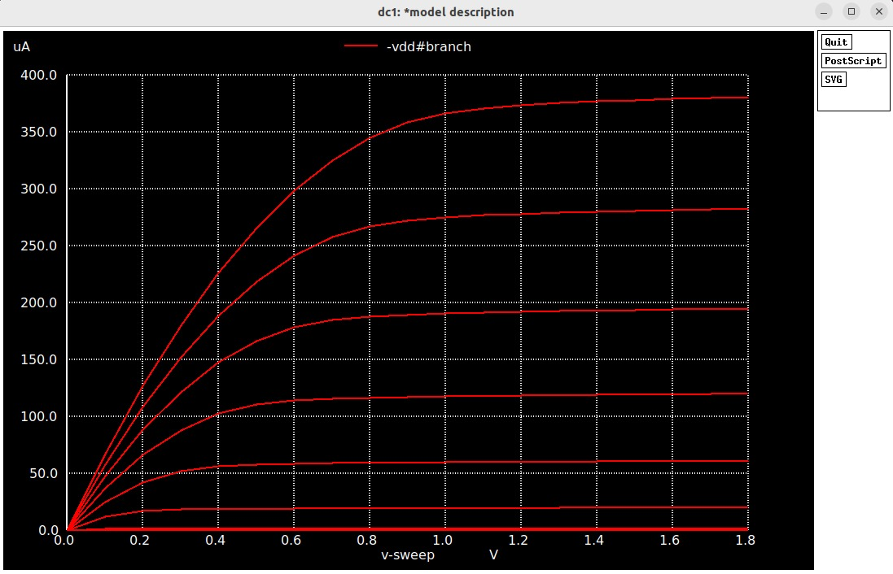
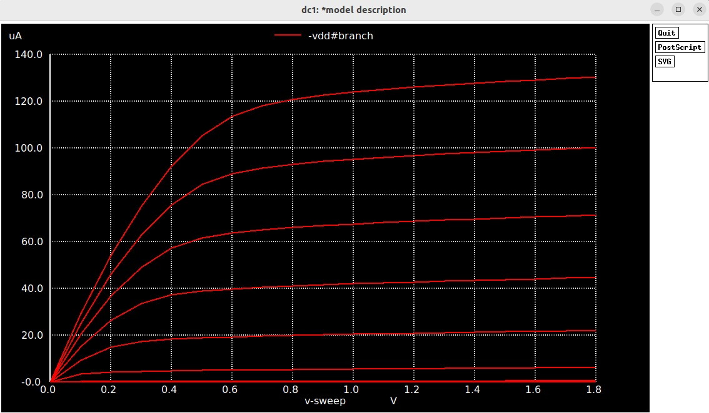
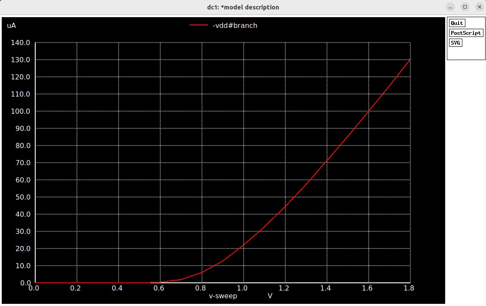
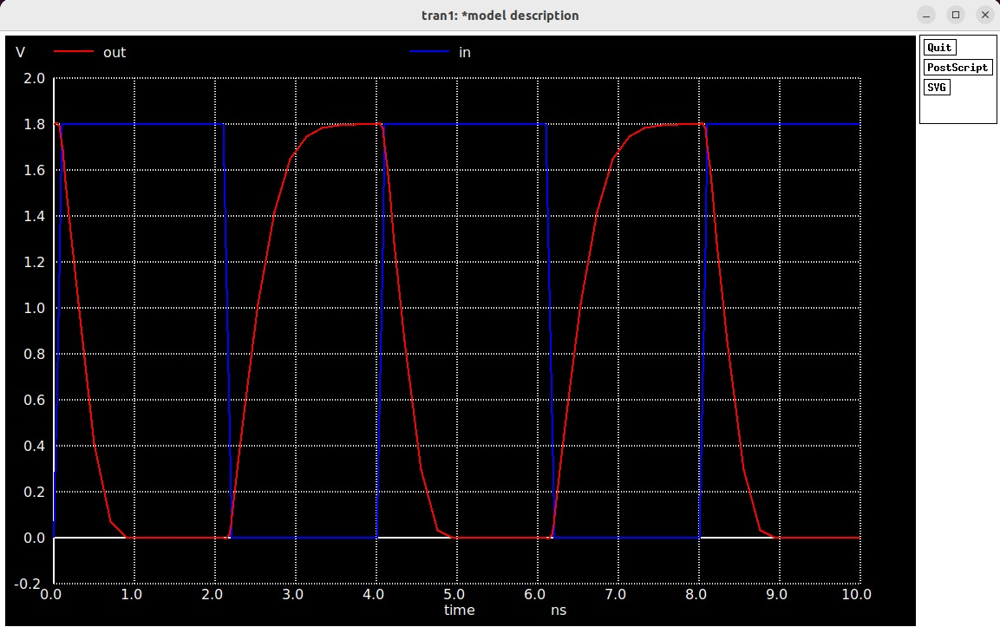
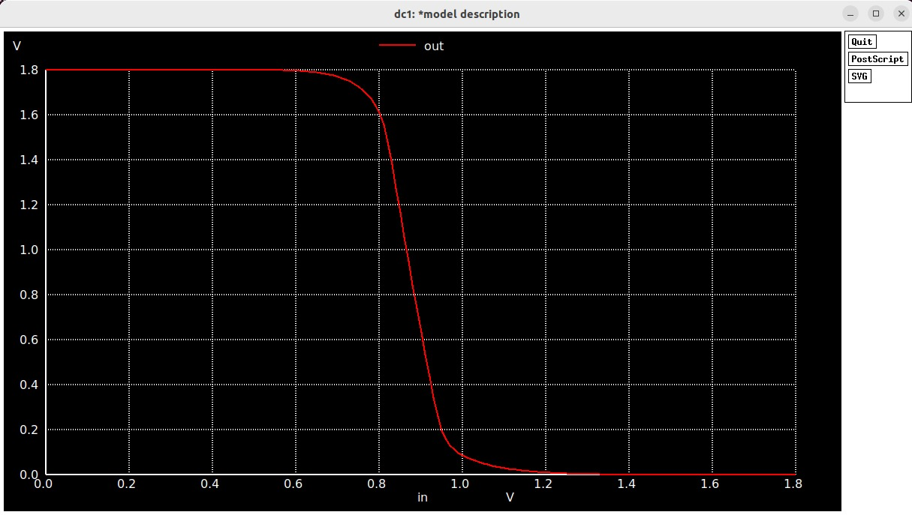
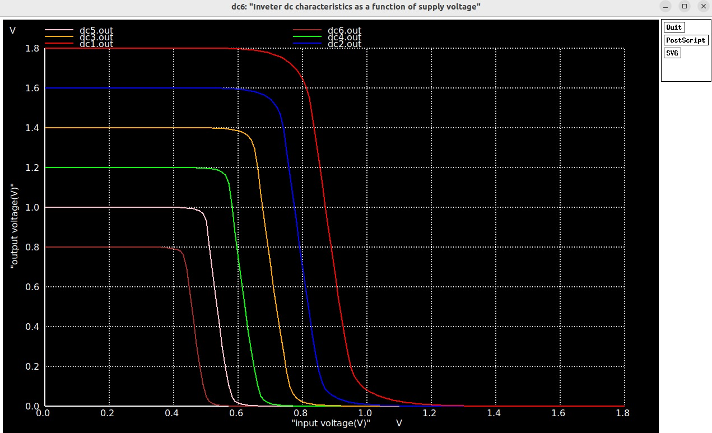
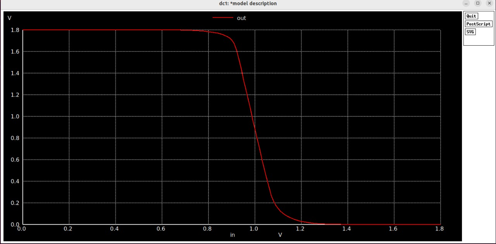

| Section                                                              | Description                                                              |
| -------------------------------------------------------------------- | ------------------------------------------------------------------------ |
| [1. NMOS I-Vdd Curves](#1-nmos-i-vdd-curves)                         | Analysis of Drain Current vs. Drain-Source Voltage for an NMOS transistor. |
| [2. CMOS Inverter VTC Curve](#2-cmos-inverter-vtc-curve)               | Analysis of the inverter's static voltage transfer characteristics.      |
| [3. CMOS Id vs. Vgs Curve](#3-cmos-id-vs-vgs-curve)                      | Analysis of NMOS Drain Current vs. Gate-Source Voltage.                  |
| [4. CMOS Inverter's Switching Characteristics](#4-cmos-inverters-switching-characteristics) | Analysis of the inverter's transient (time-domain) response.             |
| [5. CMOS Inverter VTC Curve](#5-cmos-inverter-vtc-curve)               | A second look at the VTC curve, leading into the noise margin analysis.  |
| [6. Inverter's Noise Margin](#6-inverters-noise-margin)              | Calculation and analysis of the inverter's noise immunity.               |
| [7. Impact of Power Supply Variation](#7-impact-of-power-supply-variation) | How VTC changes with different supply voltages.                          |
| [8. Impact of Device Variation](#8-impact-of-device-variation)         | How manufacturing variations affect inverter behavior.                   |
| [9. Conclusion](#9-conclusion)                                         | A summary of key learnings from the simulations.                         |

---

## 1. NMOS I-Vdd Curves

* **What you see:** The plot shows a family of curves. For each curve, the drain current ($I_d$) initially rises steeply with drain voltage ($V_{ds}$) and then flattens out, becoming nearly constant. Curves higher up on the plot correspond to higher gate voltages ($V_{gs}$).
* **Why it happens (device physics):** The initial steep rise is the **linear region**, where the transistor acts like a voltage-controlled resistor. The flattening occurs when the channel near the drain gets "pinched off," and the transistor enters the **saturation region**. At this point, the current is limited and is primarily controlled by the gate voltage, not the drain voltage. A higher gate voltage creates a more conductive channel, allowing a higher saturation current.
* **How this ties back to STA concepts:** The maximum saturation current ($I_{dsat}$) is the physical basis for a gate's **drive strength**. This value directly determines how quickly a transistor can charge or discharge the capacitance of the next gate. The delay models (`.lib` files) used in Static Timing Analysis (STA) are sophisticated abstractions of these very I-V curves. A higher drive strength (higher saturation current) results in a lower **cell delay**.

---

## 2. CMOS Inverter VTC Curve

* **What you see:** This is a plot of the inverter's output voltage versus its input voltage. The output is high when the input is low and low when the input is high. There is an extremely steep, almost vertical transition between the two states.
* **Why it happens (device physics):** This behavior is due to the complementary action of the PMOS (pull-up) and NMOS (pull-down) transistors. When the input is low, the PMOS is on and the NMOS is off, connecting the output to the high supply voltage ($V_{DD}$). When the input is high, the NMOS is on and the PMOS is off, connecting the output to Ground. The steep transition occurs at the **switching threshold**, where both transistors are momentarily, partially conducting.
* **How this ties back to STA concepts:** A well-defined VTC with stable high and low levels is a prerequisite for a functional digital gate that can be analyzed by STA. The sharpness of the transition (gain) ensures that the gate is a decisive switch, which is essential for predictable timing behavior.

---

## 3. CMOS Id vs. Vgs Curve

* **What you see:** The drain current is zero until the input (gate voltage) reaches a "knee" in the curve, after which the current rises steeply and continues to increase.
* **Why it happens (device physics):** The "knee" represents the transistor's **threshold voltage ($V_{th}$)**. Below this voltage, the transistor is in **cutoff** (off). Once the gate voltage exceeds $V_{th}$, a conductive channel forms, the transistor turns on, and current begins to flow. The current increases with gate voltage because the channel becomes progressively more conductive.
* **How this ties back to STA concepts:** The threshold voltage is a critical parameter in the timing models used by STA. Variations in $V_{th}$ (modeled by process corners) directly affect a gate's performance. A higher-than-nominal $V_{th}$ means the gate turns on later and provides less current for a given input, making it slower and increasing its delay.

---

## 4. CMOS Inverter's Switching Characteristics

* **What you see:** The output signal (red) is an inverted version of the input signal (blue). However, it is delayed in time, and its rising and falling edges are sloped, not instantaneous.
* **Why it happens (device physics):** The **propagation delay** occurs because it takes a finite amount of time for the transistors' current to charge or discharge the load capacitance at the output. The sloped edges, known as **rise and fall times**, are also a direct result of this charging/discharging process. A stronger transistor provides more current, resulting in faster charge/discharge and steeper slopes.
* **How this ties back to STA concepts:** This plot is the direct physical measurement of the two most important metrics in STA: **cell delay** (propagation delay) and **output transition time** (slew). The timing libraries (`.lib` files) are essentially large lookup tables of these values, characterized across different input slews and output loads. STA works by adding these delays along a circuit path.

---

## 5. CMOS Inverter VTC Curve

* **What you see:** We again observe the VTC curve, noting its stable high and low output levels that extend over wide ranges of input voltages.
* **Why it happens (device physics):** The complementary PMOS/NMOS structure ensures that in a steady state, one transistor is fully on while the other is fully off. This creates a low-impedance path to either $V_{DD}$ or Ground, resulting in very stable output logic levels that are robust against small fluctuations.
* **How this ties back to STA concepts:** This stability is the basis for **noise margins**. In STA, while delay is the primary concern, signal integrity is a close second. Noise, such as crosstalk from neighboring wires, can affect a signal's voltage. A gate with good noise margins is less likely to have its timing affected by such noise.

---

## 6. Inverter's Noise Margin

* **What you see:** By identifying the points on the VTC where the slope is -1 ($V_{IL}$ and $V_{IH}$), we can calculate the **noise margins** for both low ($NM_L$) and high ($NM_H$) logic levels. For this inverter, both margins are large and roughly equal.
* **Why it happens (device physics):** These margins exist because there is a wide "buffer zone" of input voltages that produce a valid high or low output. The region between $V_{IL}$ and $V_{IH}$ is the uncertain transition zone. The size of the valid input regions relative to the output levels defines the circuit's immunity to noise.
* **How this ties back to STA concepts:** Robust noise margins are critical for reliable timing. Noise can cause a signal to cross the switching threshold earlier or later than expected, adding **jitter** and uncertainty to a timing path. If noise is large enough to violate the noise margin, the circuit can fail functionally, making any timing analysis invalid. Advanced STA tools incorporate noise analysis (crosstalk) to ensure these margins are not violated.

---

## 7. Impact of Power Supply Variation

* **What you see:** As the supply voltage ($V_{DD}$) is lowered, the entire VTC curve shrinks vertically. The maximum output voltage drops, and the switching threshold shifts to a lower input voltage.
* **Why it happens (device physics):** Transistor drive current is highly dependent on the supply voltage. A lower $V_{DD}$ results in a weaker electric field and lower carrier velocity, which significantly reduces the current. This makes the transistors weaker, slowing down their ability to charge the output capacitance and reducing their noise margins.
* **How this ties back to STA concepts:** This is a cornerstone of STA. The **"slow corner"** used in timing analysis is always defined at the **minimum expected supply voltage**. This is because a voltage droop directly increases propagation delay. STA must verify that all paths meet timing even in this worst-case low-voltage scenario.

---

## 8. Impact of Device Variation

* **What you see:** This single curve represents the ideal, nominal behavior. With random manufacturing variations, this single line would become a "fuzzy band" of many possible VTC curves, with the switching threshold shifting left or right.
* **Why it happens (device physics):** Random, unavoidable imperfections in the manufacturing process (e.g., in channel length, oxide thickness) alter the physical properties of transistors. This changes their threshold voltages and drive strengths, making some individual transistors stronger (faster) and some weaker (slower) than the nominal design.
* **How this ties back to STA concepts:** This is the entire reason for performing STA at different **process corners** (e.g., slow, typical, fast). The corners model the statistical extremes of these random variations. The "slow" corner models the worst-case combination that makes transistors weak and slow. By verifying timing at these corners, designers guarantee that the chip will function correctly regardless of where its performance falls within the spectrum of manufacturing variations.

---

## 9. Conclusion
* **How transistor-level behavior constrains timing in real circuits:** The timing of a digital circuit is fundamentally constrained by the physics of its transistors. The maximum **saturation current** ($I_{dsat}$)—determined by the transistor's physical size, threshold voltage, and supply voltage—dictates how quickly it can charge or discharge capacitance. This charging/discharging time *is* the gate's propagation delay. The speed limit of any path in a circuit is simply the sum of these fundamental delays, which are rooted in the physical limits of how much current a transistor can provide.

* **How variation or supply changes can affect STA margins & critical paths:** Variations are not just a theoretical concern; they have direct, critical impacts on STA. A **power supply droop** weakens all transistors, increasing their delay. This can cause a path that was not previously the slowest to suddenly become the new **critical path**, leading to a timing failure. Similarly, **device variation** can randomly weaken a gate on the critical path, using up all the available timing slack. Both types of variation also shift the switching threshold, which can shrink the circuit's **noise margins**, making it vulnerable to functional failures from noise (crosstalk) that could invalidate the entire timing analysis. Therefore, designing for and verifying against these variations using multi-corner STA is essential for creating a robust and reliable chip.
